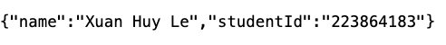

## Prerequisites
- Docker Engine 20.10+ installed
- Docker Compose 2.0+ installed
- Ports 3001, 4000, and 27017 available on your system

## Quick Start

### Clone the repository:
```bash
git clone https://github.com/huylx222/SIT725_2025
cd SIT725_2025/task8.3
```

### Build and start all services:
```bash
docker-compose up --build
```

### Stop all services:
```bash
docker-compose down
```

### Access Points
* Frontend: http://localhost:3001
* Backend API: http://localhost:4000
* Student Endpoint: http://localhost:4000/api/student
* Health Check: http://localhost:4000/api/v1/health

### Expected Output For Student Endpoint:
